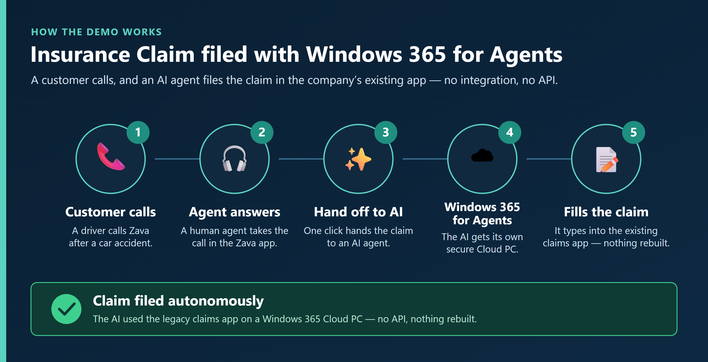

# Windows 365 for Agents + Computer Use lab

A hands-on lab for building **agentic automation** on **Windows 365 for Agents (W365A)** with
**Microsoft Copilot Studio Computer Use (CUA)**. The first demo here: a Copilot Studio agent
picks up a contact-center call from a modern CCaaS desktop, drives a **legacy Windows claims
app** end-to-end on a W365A Cloud PC, and returns the result to the caller — **with no API into
the legacy system.** More CUA + W365A scenarios will be added over time.

> **The wedge:** partners have spent years saying *"we can't automate that workflow —
> there's no API on the legacy system."* This demo gives them a new answer.

---

## Demo



A ~2.5 min guided walkthrough (English) covers the end-to-end call → hand-off → AI files the claim, the Copilot Studio configuration, and the Computer Use audit trail (screenshots + reasoning for every step). GitHub doesn't play repository-hosted videos inline, so **download it to watch:** [`docs/media/zava-ccaas-demo-guided-en.mp4`](apps/ccaas-agent-desktop/docs/media/zava-ccaas-demo-guided-en.mp4?raw=1).

> **Available in Japanese too.** The Agent Desktop UI switches between English and Japanese with the **EN / 日本語** toggle in the top bar (the AI agent also narrates in the selected language). Japanese walkthrough: [`docs/media/zava-ccaas-demo-guided-ja.mp4`](apps/ccaas-agent-desktop/docs/media/zava-ccaas-demo-guided-ja.mp4?raw=1).

---

## How it works

1. **CCaaS Agent Desktop** — a modern web app; the *human* agent's screen. The call
   arrives and the human clicks **"Hand off to AI."**
2. **The AI agent** — a **Copilot Studio** agent (invoked over **Direct Line**) with
   **Computer Use**. It operates a Windows desktop by *looking at the screen and
   clicking* — no API into the legacy system.
3. **Legacy Claims Workstation** — a deliberately old Win32 app (`claims.exe`) the AI drives.

**Two separate Cloud PCs — don't confuse them:**

| Component | What it is | Who uses it | What's deployed |
|---|---|---|---|
| **Agent workstation** | A Windows 365 Cloud PC (Enterprise / Flex / Frontline) | The **human** agent signs in | The **CCaaS Agent Desktop**, as an **Edge force-installed web app (PWA)** with a desktop icon |
| **W365A pool** | A **separate** Windows 365 for Agents Cloud PC | The **AI agent** runs here — no human signs in | The **legacy Claims app** (`claims.exe`) |

**The flow:** a call hits the CCaaS desktop → the human clicks **Hand off to AI** → the
**handoff orchestrator** (an Azure Durable Functions app) invokes the Copilot Studio agent
over Direct Line → on the W365A pool the AI opens `claims.exe`, drives the claim wizard by
sight, reads the new **claim ID** off the screen → the result returns to the CCaaS desktop.

> **Two AI backends.** The default above is **Microsoft Copilot Studio** (MCS). You can
> instead (or additionally) use **Azure AI Foundry + Windows 365 for Agents** via
> [`samples/foundry-w365a-runner`](./samples/foundry-w365a-runner). Pick at build time with
> `Build-DemoFromScratch.ps1 -AgentBackend mcs|foundry|both` (or set `agentBackend` in the
> config). `both` bakes both endpoints into the SPA so the desktop's backend toggle switches
> between them live. Both speak the **same** handoff contract, so the CCaaS desktop and
> orchestrator are identical either way. See
> [`docs/config-reference.md`](docs/config-reference.md#agentbackend--choose-the-ai-backend-optional-defaults-to-mcs).

> **In-app near-live view + audit trail (Option A).** When the agent uses *Authenticate with
> Microsoft* (required for the Copilot Studio Activity / Session-replay audit trail), the
> browser-direct Direct Line stream no longer works. The supported way to keep an in-app view of
> the Computer Use run **and** the audit trail is to start the run from an **autonomous Dataverse
> trigger** and poll the run's screenshots for a near-live view. See
> [`docs/option-a-inapp-near-live.md`](docs/option-a-inapp-near-live.md).

---

## Prerequisites

- An **M365 E5** tenant (Entra-joined; no on-prem AD required) and an **Azure
  subscription** where you have **Contributor** — on the subscription, or on a
  pre-created resource group matching the config (the build creates the resource group if
  it doesn't already exist).
- **Two Cloud PCs** (you create these — the build never provisions Cloud PCs or licences):
  - the **human agent workstation** (Windows 365 Enterprise / Flex / Frontline), and
  - the **W365A pool** Cloud PC. Pool how-to: **[`docs/w365a-pool.md`](docs/w365a-pool.md)**.
- **Microsoft Copilot Studio** access with the **Computer Use** capability enabled in your
  Power Platform environment.
- The agent must **require authentication** via **Authenticate manually** (Settings → Security →
  Authentication → *Authenticate manually* — a custom Entra app registration; **not** *No
  authentication* and **not** *Authenticate with Microsoft*, which disconnects the Direct Line channel
  the orchestrator uses). **Computer Use is disabled for unauthenticated agents** — leaving it open
  makes the handoff fail before any Cloud PC run (Test pane: *"CUA is disabled for unauthenticated
  agents"*).
- A **Windows 365 for Agents pay-as-you-go billing policy** attached to that environment (issue
  #77) — **separate from** Copilot Studio entitlement and **not** covered by M365/Copilot
  licensing. It's what lets the pool provision **real Cloud PCs** (a provisioning policy requires an
  active billing plan); without it you can't get a machine-backed pool. When attaching it, **set
  always-available = 1 Cloud PC (~$5/mo)** in the Intune provisioning policy so there's no cold start.
  (Note: a dead handoff with the pool showing *0 runs* is usually the **agent-authentication** issue
  above, not billing.) See [`docs/licensing-and-entitlement.md`](docs/licensing-and-entitlement.md#also-required-a-windows-365-for-agents-pool-billing-policy-separate-meter-issue-77).
- **Microsoft Intune** access (delivers the legacy app and the CCaaS Edge web app).
- Local tooling: **Azure CLI** (`az`), **Node.js 20+** (`node`, `npm`), **PowerShell 7**
  (`pwsh`), and **Azure Functions Core Tools v4** (`func`,
  `npm i -g azure-functions-core-tools@4`). The build checks these and fails fast with the
  exact install command if one is missing.

### One-time tenant setup (once per tenant)

> **Shortcut:** several steps below and in the linked guides are portal/admin toggles. If you use an
> AI desktop agent that can drive your browser/shell as you (e.g. Microsoft Scout), you can delegate
> most of them with your review — see [`docs/setup-with-an-ai-agent.md`](docs/setup-with-an-ai-agent.md)
> for a ready-to-paste prompt.

1. Run **[`scripts/Enable-W365aPrereqs.ps1`](scripts/Enable-W365aPrereqs.ps1)** as a
   **Global / Intune Admin**:
   ```powershell
   pwsh -File .\scripts\Enable-W365aPrereqs.ps1 -TenantId <tenant-id> -CreateDynamicGroup
   ```
   Enables the Entra prerequisites the W365A pool needs. `-CreateDynamicGroup` also hides the
   Remote Desktop consent prompt so Computer Use runs don't fail.
2. Two portal toggles: enable **Computer Use** in your Power Platform environment, and in
   Intune allow **Windows (MDM)** corporate enrollment.

> Sign in interactively when prompted (`az login`, plus the scripts' device-code / interactive
> sign-in). Only for **unattended / app-only** runs do you first create an app registration with
> [`scripts/Bootstrap-DemoServicePrincipal.ps1`](scripts/Bootstrap-DemoServicePrincipal.ps1)
> (Global Admin) and set `appRegistration` in the config — otherwise it isn't needed.

---

## Deploy the demo

One script (**[`scripts/Build-DemoFromScratch.ps1`](scripts/Build-DemoFromScratch.ps1)**) and
one config file stand up everything else — in any tenant, subscription, or region. Nothing in
the scripts is hardcoded.

**It builds:** the handoff orchestrator (Durable Functions backend — resource group, Storage,
Function app with a managed identity, Key Vault holding the secret + callback key); the central
host for the CCaaS web app (**Azure Static Web Apps, Free tier — $0**, with the orchestrator
URL baked into the desktop build); the Entra targeting groups; the legacy Win32 claims app; and
the CCaaS app as an Edge force-installed web app (PWA).

### 1. Create the config file

```powershell
Copy-Item .\scripts\demo-config.sample.json .\scripts\demo-config.local.json
```

Edit `demo-config.local.json` (it is git-ignored — never commit it). **For your first build,
set just 3 fields:** `azure.subscriptionId`, `azure.tenantId`, `azure.location`. Leave
everything else as-is — blanks are auto-filled. Field-by-field help:
**[`docs/config-reference.md`](docs/config-reference.md)**.

> Leave `handoffOrchestrator.directLineSecret` **blank** — you get it in step 3.

### 2. Run the build

```powershell
# Preview every change without touching anything:
pwsh -File .\scripts\Build-DemoFromScratch.ps1 -WhatIf
# Then build for real (add -DeviceCode on a headless admin box):
pwsh -File .\scripts\Build-DemoFromScratch.ps1
```

The website and infrastructure deploy. The AI backend is **skipped** because the secret is
blank — that's expected; you add it next.

### 3. Build and publish the Copilot Studio agent

> **Licensing gate — set this up first.** Publishing the agent to the **Direct Line / Web / Mobile
> app** channel (which the orchestrator needs) is **premium** Copilot Studio usage. Without a
> durable entitlement, Copilot Studio shows a *"Start a 60-days free trial"* prompt — and a trial
> is **not durable** for a reusable demo. Recommended: **pay-as-you-go billing** linked to an Azure
> subscription (cents per run). See [`docs/licensing-and-entitlement.md`](docs/licensing-and-entitlement.md).
>
> **Two meters, not one.** The Copilot Studio entitlement only unblocks the **channel**. The
> **Computer Use Cloud PC pool** that drives `claims.exe` needs its **own** Windows 365 for Agents
> PAYG **billing policy** on the environment (issue #77) — it's what lets the pool provision **real
> Cloud PCs** (no billing plan → no machine-backed pool). Attach both; set **always-available = 1
> (~$5/mo)** in the Intune provisioning policy. (A dead handoff with *0 runs* is usually the
> **agent-authentication** gate, not billing.) See [`docs/licensing-and-entitlement.md` → pool billing policy](docs/licensing-and-entitlement.md#also-required-a-windows-365-for-agents-pool-billing-policy-separate-meter-issue-77).

> **Preflight (do this first):** Copilot Studio needs a Power Platform environment **with a Dataverse
> database**. If the portal shows only a spinning **"loading donut"** (and never the app), your
> environment is missing Dataverse — the **default** environment (`databaseType: None`) does **not**
> work. Verify/fix this before continuing:
> [`docs/build-the-agent.md` → Preflight](docs/build-the-agent.md#preflight-make-sure-copilot-studio-actually-loads-dataverse).

Follow **[`docs/build-the-agent.md`](docs/build-the-agent.md)**: create the agent → turn on
Generative Orchestration (**before** adding Computer Use — the tool requires it) → **require
authentication** (Settings → Security → Authentication → *Authenticate manually*) → add the
**Computer Use** tool pointed at your W365A pool → publish.
**Publishing generates the Direct Line secret** — copy it.

> **Handoff connects but times out at `ready` with the pool showing 0 runs ever?** The agent is set
> to **No authentication** — Computer Use is **disabled for unauthenticated agents** (Test pane:
> *"CUA is disabled for unauthenticated agents. Please change your agent security settings."*). Fix:
> Settings → Security → Authentication → **Authenticate manually** (a custom Entra app registration —
> **not** *Authenticate with Microsoft*, which disconnects Direct Line) → Save → Publish, then re-copy
> the Direct Line secret if it rotated. See
> [`docs/build-the-agent.md` → step 2](docs/build-the-agent.md#2-turn-on-generative-orchestration) and
> [`docs/w365a-pool.md` → pool healthy but Computer Use never runs](docs/w365a-pool.md#if-the-pool-is-healthy-but-computer-use-never-runs-handoff-times-out-at-ready).

> **Adding the Computer Use tool errors with `connectionReference is not defined`, or the machine
> drop-down has no `Cloud PC pool` option?** These are environment/provisioning gates (generative
> orchestration off, a brand-new environment still provisioning, DLP, or cross-geo).
> See [`docs/build-the-agent.md` → step 3](docs/build-the-agent.md#3-add-the-computer-use-tool-and-point-it-at-your-pool)
> and [`docs/w365a-pool.md` troubleshooting](docs/w365a-pool.md#if-the-machine-drop-down-has-no-cloud-pc-pool-option).

### 4. Add the secret and re-run the build

Paste the secret into `handoffOrchestrator.directLineSecret`, then run the build again. This
time the AI backend deploys and prints an **orchestrator callback URL** and **callback key**.

### 5. Finish the agent

Paste the callback URL + key into the agent's **result-callback flow**
([`docs/handoff-runbook.md`](docs/handoff-runbook.md) §2c) and **re-publish**.

### 6. Onboard the two machines

Add them to the Entra groups the build created (in the portal, or seed them in the config):
add the **pool** Cloud PC device to the agent-pool device group (`agentPool.pilotCloudPcName`)
so the claims app installs; add the **human agent** user to the workstation user group
(`agentWorkstation.agentUserName`) so the CCaaS desktop icon (Edge web app) follows them.

> [!NOTE]
> The demo runs on the **Windows 365 for Agents Cloud PC pool**. `claims.exe` is delivered
> to that pool via **Intune as a required Win32 app**. Copilot Studio Cloud PC pools are
> **Entra-joined and Intune-enrolled** per Microsoft GA documentation, so the app is
> pre-installed before the Computer Use session starts and the agent simply launches it.
> No self-provisioning, SWA binary hosting, or runtime download is needed. See
> [`docs/w365a-pool.md`](docs/w365a-pool.md#getting-claimsexe-onto-the-pool).

> **Static Web Apps region:** SWA managed Functions run only in a limited set of regions
> (`westus2`, `centralus`, `eastus2`, `westeurope`, `eastasia`) — not `australiaeast`. Leave
> `staticWebApp.location` **blank** and the build auto-picks the nearest supported region and
> tells you which. Static content is served globally regardless.

---

## Test, reset, and tear down

- **Test:** open the CCaaS desktop on the human workstation, take the sample call, click
  **Hand off to AI**, and watch the agent file the claim on the W365A pool. The desktop shows
  **"Claim filed"** with the claim ID.
- **Show it's auditable:** after a run, open the agent's **Activity** in Copilot Studio and replay
  the screenshots + reasoning. Set this up once via
  [`docs/cua-auditability.md`](docs/cua-auditability.md); demo the backend (Intune, Copilot Studio,
  Agent 365) via [`docs/demo-backend-walkthrough.md`](docs/demo-backend-walkthrough.md).
- **Reset between demos:** refresh the agent's connection (Copilot Studio → Settings →
  Connections) and clear any test claims.
- **Tear down:**
  ```powershell
  pwsh -File .\scripts\Remove-DemoEnvironment.ps1 -TenantId <tenant>            # preview
  pwsh -File .\scripts\Remove-DemoEnvironment.ps1 -TenantId <tenant> -Execute   # apply
  ```
  Removes the Intune apps + Edge web-app policy, the groups, the scope tag, the handoff orchestrator
  (add `-PurgeKeyVault` to also purge the soft-deleted Key Vault), and the Static Web App (add
  `-RemoveResourceGroup` to delete the resource group too). The Cloud PCs and user accounts are
  never deleted.

---

## Repository structure

| Folder | What it is |
|---|---|
| [`apps/ccaas-agent-desktop/`](./apps/ccaas-agent-desktop/) | **CCaaS Agent Desktop** — the human agent's web app (React + Vite + TypeScript) |
| [`apps/legacy-claims-workstation/`](./apps/legacy-claims-workstation/) | **Legacy Claims Workstation** — the Win32 `claims.exe` the AI drives |
| [`apps/handoff-orchestrator/`](./apps/handoff-orchestrator/) | **Handoff orchestrator** — the Azure Durable Functions backend |
| [`samples/foundry-w365a-runner/`](./samples/foundry-w365a-runner/) | **Foundry + Windows 365 for Agents runner** — the alternative AI backend (drives `claims.exe` via the Foundry Computer Use loop) |
| [`scripts/`](./scripts/) | Deployment + teardown scripts |
| [`docs/`](./docs/) | Deployment guides ([build-the-agent](docs/build-the-agent.md), [config-reference](docs/config-reference.md), [w365a-pool](docs/w365a-pool.md), [handoff-runbook](docs/handoff-runbook.md)), demo guides ([demo-flow](docs/demo-flow.md), [demo-backend-walkthrough](docs/demo-backend-walkthrough.md)), and [cua-auditability](docs/cua-auditability.md) |

> **Status: pre-release.** The apps are being built from spec; downloadable release artifacts
> will appear on the [releases page](https://github.com/RoelDU/w365-for-agents-cua-lab/releases) once v1.0
> ships. To build them yourself today, see [`docs/BUILD.md`](./docs/BUILD.md).

---

## License

[MIT](./LICENSE)

## A note on the fictional brand

The **Zava Mutual** insurance carrier and **Zava Contact Center** CCaaS provider are fictional.
Zava is a Microsoft-standard fictional brand. All customers, policies, claims, and transcripts
in the seed data are fabricated — no real personal, financial, or insurance data is included.

## Trademarks

This project may contain trademarks or logos for projects, products, or services. Authorized
use of Microsoft trademarks or logos is subject to and must follow
[Microsoft's Trademark & Brand Guidelines](https://www.microsoft.com/en-us/legal/intellectualproperty/trademarks).
Use in modified versions must not cause confusion or imply Microsoft sponsorship. Third-party
trademarks or logos are subject to those third parties' policies.
