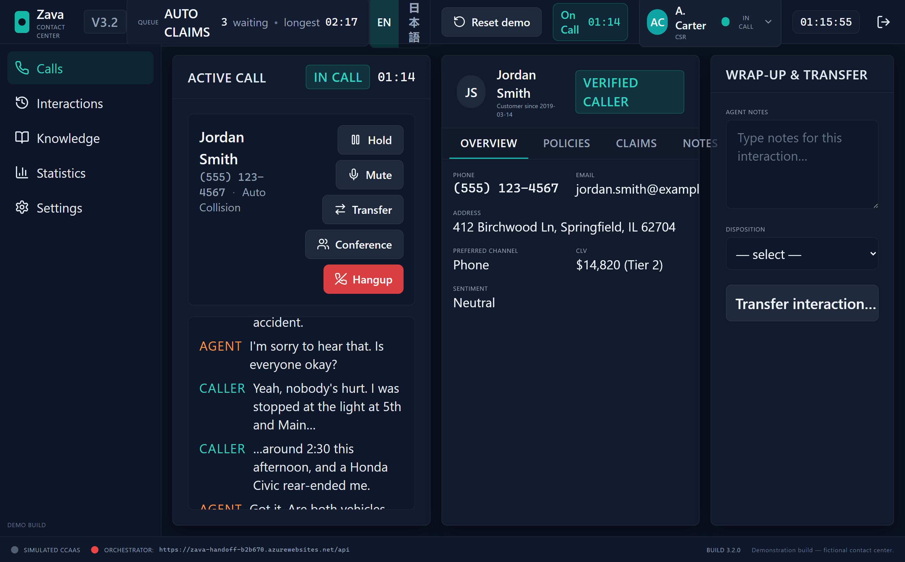
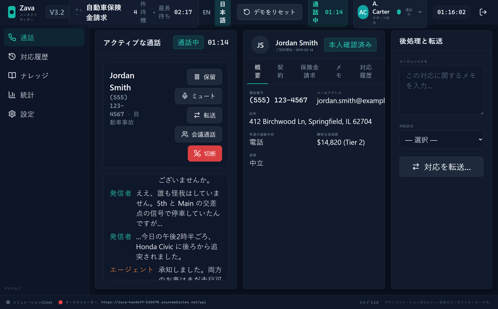

# Zava Contact Center — Agent Workspace (CCaaS Agent Desktop)

[](../../.github/workflows/ccaas-agent-desktop.yml)

The **modern half** of the [`CCaaSDemoApp`](../../) demo pair: a
React + Vite + TypeScript SPA styled after **Genesys Cloud**, **Five9 Agent
Desktop Plus**, **NICE CXone**, and **Talkdesk Callbar**. It is where the
human contact-center agent sits, takes a call, and clicks **Transfer to AI
Agent** to invoke an Agent365-managed Foundry agent + Computer Use that
drives the sibling [Legacy Claims Workstation](../legacy-claims-workstation/)
inside a W365A Cloud PC.

> *Brand:* **Zava Contact Center — Agent Workspace v3.2**
> *Footer:* *Demonstration build — fictional contact center. Not connected
> to a real telephony or CCaaS provider.*

### How the demo works


### Guided demo videos (English / 日本語)

Two short, narrated walkthroughs show the full run end to end — the call, the
hand-off to AI, the claim being filed on a **Windows 365 for Agents** Cloud PC,
and a tour of how the agent is configured in Copilot Studio (including the
Computer Use tool's Cloud PC pool connection) plus the per-run screenshots and
reasoning the agent records.

| Language | Video |
| --- | --- |
| English | [`docs/media/zava-ccaas-demo-guided-en.mp4`](./docs/media/zava-ccaas-demo-guided-en.mp4) |
| 日本語 (Japanese) | [`docs/media/zava-ccaas-demo-guided-ja.mp4`](./docs/media/zava-ccaas-demo-guided-ja.mp4) |

### The agent workspace (English / 日本語)

The UI ships bilingual — toggle **EN / 日本語** in the top bar, or start with
`?lang=ja`. The whole workspace (call panel, Customer 360, transcript, AI agent
status) localizes live with no reload.

| English | 日本語 (Japanese) |
| --- | --- |
|  |  |

## At a glance

- **Stack:** React 18, Vite 5, TypeScript 5, Tailwind CSS 3, shadcn/ui
  (Radix UI), Lucide icons, Zustand stores, React Router 6, Ajv 8, MSAL
  (Entra ID sign-in), Vitest + RTL + MSW.
- **Auth:** Microsoft Entra ID sign-in via MSAL (the single, default, and only
  sign-in path). Configure the app registration with `VITE_AZURE_*` or a served
  `/entra-config.json` (copy [`public/entra-config.sample.json`](./public/entra-config.sample.json)
  → `public/entra-config.json`, which is gitignored).
- **Inbound call simulation:** Jordan Smith / Morgan Lee / Pat Rivera hero
  scenarios identical to the legacy app, with scripted transcripts that
  type out at a configurable cadence.
- **Transfer to AI Agent:** the demo wedge — modeled as the realistic CCaaS
  **transfer-to-destination** gesture. The call-toolbar **Transfer** control
  (or `Ctrl+Shift+H`) opens a **Transfer Directory** where the AI agent
  ("Claims Automation Agent") is one destination alongside human queues; the
  interaction context travels automatically with the transfer (today's
  structured-JSON model, framed as the emerging A2A handover direction).
  Selecting the AI agent opens a confirmation modal that renders the handover
  context as a labeled card and exposes the raw schema-validated
  [`CallContext`](../../schemas/call-context.schema.json) JSON behind a
  developer "View payload" disclosure. On confirm it POSTs the `CallContext`
  to the SWA-hosted `/api/handoff` endpoint (or to an explicitly configured
  local endpoint for legacy/local testing). See
  [`docs/agentic-handover-mechanism.md`](../../docs/agentic-handover-mechanism.md)
  for how this maps to real CCaaS platforms, the Microsoft Agent platform, and
  the MCP-vs-A2A standards trajectory.
- **AI Agent Status card:** live `queued → prefilled → ready → submitted`
  state from the SWA `/api` status endpoint (polling with the Foundry
  `thread_id` and `run_id`). On `submitted` the claim ID is copied to the
  clipboard and surfaced as a desktop-style toast for the CSR to read back to
  the caller.
- **CUA-friendly:** stable `data-testid`/`aria-label`s on every control,
  `?cua=true` URL flag disables typewriter animation, removes ring delay,
  auto-confirms the handoff modal, and tightens polling to 500 ms.
- **Static Web Apps deploy:** the primary demo host is Azure Static Web Apps.
  The same SWA hosts the SPA and the managed Functions `/api` endpoint. Current
  build is **≈162 KB gzipped**, well under the 1.5 MB budget.

## Quick start

```powershell
cd C:\Dev\Work\CCaaSDemoApp\apps\ccaas-agent-desktop
npm install
npm run dev
# → http://localhost:5173
```

| Script | What it does |
| --- | --- |
| `npm run dev` | Vite dev server on port 5173 (strict) |
| `npm run build` | Type-check + production build into `dist/` |
| `npm run preview` | Serve the built `dist/` on port 4173 |
| `npm test` | Vitest run (71 tests across stores, lib, components, schemas, E2E) |
| `npm run test:coverage` | Same with v8 coverage |
| `npm run lint` | ESLint over `src/` and `tests/` |
| `npm run format` | Prettier write |
| `node scripts/gzip-size.cjs` | Verify the 1.5 MB gzipped budget |

## Demo flow (45 seconds)

1. Open the app → **Sign in with Microsoft** (Microsoft Entra ID).
2. Click **Simulate Inbound Call** (default scenario = Jordan Smith).
3. Watch the call ring, auto-answer, and start streaming the canned transcript.
4. Click **Transfer** in the call toolbar (or `Ctrl+Shift+H`) to open the
   **Transfer Directory**, choose **Claims Automation Agent · AI**, review the
   rendered handover-context card (optionally expand **View payload (JSON)**),
   and confirm.
5. In the deployed demo, the app posts to the SWA `/api/handoff` endpoint and
   you'll see the status card go **queued → prefilled → ready → submitted
   (CLM-2024-NNNNNN)** as it polls the returned Foundry run identifiers.
6. For local development, override the handoff base URL if you are intentionally
   testing a legacy/local endpoint.

For an unattended end-to-end demo, append `?cua=true` — the app will skip
ring delay, type instantly, auto-confirm the handoff modal, and poll at
500 ms.

## Environment variables

Copy [`.env.example`](./.env.example) → `.env.local` to override. **All
variables are optional** — defaults make the app fully usable without any
configuration.

| Variable | Default | Purpose |
| --- | --- | --- |
| `VITE_AZURE_CLIENT_ID` | — | Entra app-registration client id (enables sign-in) |
| `VITE_AZURE_TENANT_ID` | `common` | Tenant ID for Entra sign-in |
| `VITE_AZURE_REDIRECT_URI` | `http://localhost:5173/` | Must match app registration |
| `VITE_ORCHESTRATOR_URL` | `/api` | Base URL for the handoff API. The deployed default is the SWA-managed `/api`; set a local URL only for legacy/local testing. |
| `VITE_DIRECTLINE_TOKEN_URL` | — | **Build-time fallback** for the live-desktop region (see below). Prefer the runtime `region-config.json` instead — it switches regions with no rebuild. |
| `VITE_BUILD_VERSION` | `3.2.0` | Shown in the footer status bar |

## Choosing the CUA region (any region, no rebuild)

The **Transfer to AI Agent** button streams a live Computer Use desktop from a
Copilot Studio agent whose Windows 365 Cloud PC runs in a specific geography
(the agent's Power Platform environment region). To keep the demo portable —
a US builder drives a US Cloud PC, an Australian builder drives an AU one — the
region is resolved at **runtime**, not baked into the build.

Copy [`public/region-config.sample.json`](./public/region-config.sample.json)
→ `public/region-config.json` (gitignored) and fill in your own endpoints:

```json
{
  "activeRegion": "au",
  "regions": [
    { "id": "au", "label": "Australia East", "directLineTokenUrl": "https://<au-env>.environment.api.powerplatform.com/powervirtualagents/botsbyschema/<schema>/directline/token?api-version=2022-03-01-preview" },
    { "id": "us", "label": "US Central",     "directLineTokenUrl": "https://<us-env>.environment.api.powerplatform.com/powervirtualagents/botsbyschema/<schema>/directline/token?api-version=2022-03-01-preview" }
  ]
}
```

> The real `region-config.json` and `entra-config.json` are **gitignored** —
> only the `.sample.json` templates are committed, so no tenant-specific
> endpoints live in the repo. Copy each sample to its real filename and fill it
> in before building/deploying.

- **Resolution order** (low → high): build-time `VITE_DIRECTLINE_TOKEN_URL`
  fallback → served `/region-config.json` → `?region=<id>` URL override.
- **Switch the default** by editing `activeRegion` and redeploying just the
  JSON file — no rebuild.
- **Switch per session** with `?region=us`, or in **Settings → CUA region**.
- The agent's Direct Line token URL is on **Copilot Studio → Channels → Web app
  → embed code** (the `botsbyschema/<schema>` segment is environment-specific).

See [`docs/region-config.md`](./docs/region-config.md) for the full reference.

## Shared contract with the legacy app

This app produces [`call-context.schema.json`](../../schemas/call-context.schema.json)
and posts it to the SWA-managed `/api/handoff` endpoint. The API creates a
Foundry thread/run, returns `thread_id`, `run_id`, and `status_url`, and the
status endpoint maps the Foundry result back into the desktop's
`HandoffStatusPayload`. The legacy application is driven on screen by Computer
Use; it is not handed a prefill file in the primary architecture. Hero records
are kept deliberately identical across the two apps so every handoff lands on a
matching customer.

See [`api/README.md`](./api/README.md) for the current `/api` contract.

## Further reading

- [`docs/keyboard-shortcuts.md`](./docs/keyboard-shortcuts.md) — every shortcut
- [`docs/auth.md`](./docs/auth.md) — Microsoft Entra ID (MSAL) sign-in
- [`docs/region-config.md`](./docs/region-config.md) — runtime CUA region selection
- [`api/README.md`](./api/README.md) — current SWA `/api` handoff contract
- [`docs/orchestrator-contract.md`](./docs/orchestrator-contract.md) — legacy/local reference
- [Monorepo README](../../README.md)
- [`CONTRIBUTING.md`](./CONTRIBUTING.md)

## License

[MIT](./LICENSE) — see file for full text.
